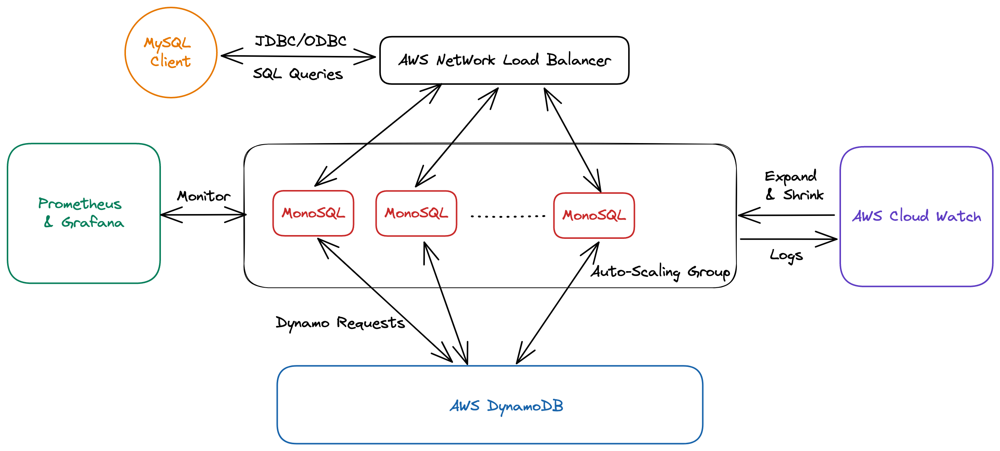

# MonoSQL from MonographDB

## 关于成章数据(MonographDB)
成章数据（MonographDB）的目标是做一个立足中国，领先世界的数据管理软件公司。
成章数据的创始团队来自于微软亚洲研究院、VMware研发中心，拥有十多年数据库研究和开发的经验，并曾在数据库顶级会议上发表多篇相关学术论文。
成章数据已获得顶级技术专家和风投投资基金的投资。成章数据致力于打造具有自主产权、业界领先的新一代企业级数据库和数据管理解决方案。

## MonoSQL产品介绍
在大数据时代，随着业务的飞速发展，企业的数据规模和流量也在不断增长。这些变化给数据库的性能和可扩展性带来了极大的挑战。传统选用MySQL等单机数据库的公司，当业务数据量和并发增加时，会遇到数据库性能瓶颈，无法满足业务快速增长。升级硬件(Scale-up)和分库分表(Scale-out)是两类解决方案，但是都存在一定局限性。

- Scale-up: 一方面，单机CPU和内存容量有限，当热数据无法全部缓存到内存时，单机数据库查询性能极具下降；另一方面，扩大CPU和内存无法解决业务对高并发写入的需求。
- Scale-out: 分库分表涉及对业务的改造，无法敏捷应对流量变化的场景。

MonoSQL是成章数据打造的一款基于DynamoDB的分布式SQL数据库，受益于DynamoDB的Serverless架构和任何数据规模下的查询个位数延时保障，MonoSQL在支持SQL生态的同时，具有极致的可扩展性，
高并发写入能力和低成本的按需计费模型。MonoSQL可以自动扩展以适应不断增长的工作负载，并提供快速、可靠的性能。此外，MonoSQL还具有强大的安全性和高可用性功能，可以确保数据安全，并减少系统停机时间。

MonoSQL适合游戏，社交，电商，Web3，金融科技等场景。在业务初创期，MonoSQL帮助用户节省成本，提供25GB免费存储，并支持按需付费模式，避免在流量波谷期产生大量数据库费用。在业务增长期，用户不需要分库分表进行业务代码改造，MonoSQL能轻松应对数据规模和流量的快速增长，支持每秒处理百万级用户并发和百万级查询请求。在业务全周期，MonoSQL提供数据的安全性和高可用能力。

## MonoSQL核心特性
1. 查询性能不受数据规模和流量影响，企业不用担心业务增长，导致数据库性能降低。
2. 高并发写入能力，支持单表多节点并发写入，支撑百万级QPS写入、更新场景。
3. 数据高可用和持久性，计算层无状态，DynamoDB赋能99.999% 跨Region高可用。
4. 降低数据库使用成本。按需计费模型，适合业务流量具有波峰波谷的场景。
5. 降低应用开发成本。MySQL生态兼容：支持JDBC，ODBC连接数据库。
6. MySQL特性兼容：支持Join，Aggregation，Recursive CTE等高级SQL功能.

## MonoSQL架构
MonoSQL支持基于Auto Scaling Groups和EKS(Kubernetes)的部署方案。MonoSQL Server是无状态SQL计算节点，通过Auto Scaling Groups按需伸缩。可选的，Redis Server可以作为MonoSQL Server的缓存节点，负责数据读请求。用户可以手动或者通过AWS Cloud Watch调整AutoScale Group的实例数。

Figure MonoSQL Architecture

## Benchmark
MonoSQL具有高并发写入能力,写入性能随MonoSQL实例数线程增长。使用Sysbench OLTP_INSERT负载进行测试, 测试结果如下：

|  实例数  | 实例机型     | OLTP_INSERT TPS |
|  :----: | :----:      |:----:           |
|   1     | c5.4xlarge  | 18810           |
|   2     | c5.4xlarge  | 37706           |
|   1     | c5.12xlarge | 61032           |
|   2     | c5.12xlarge | 124344          |
|   4     | c5.12xlarge | 251021          |

