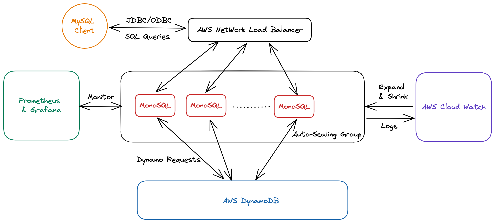

## **MonoSQL from MonographDB**

MonoSQL是成章数据打造的一款基于DynamoDB的分布式SQL数据库。受益于DynamoDB的Serverless架构和任何数据规模下的查询个位数延时保障，MonoSQL在支持SQL生态的同时，具有极致的可扩展性，
高并发写入能力和低成本的按需计费模型。

MonoSQL适合游戏，社交，电商，Web3，金融科技等场景，可以帮助用户轻松应对业务的快速增长，支持每秒处理百万级用户并发和百万级查询请求。

### **MonoSQL核心特性**
- 查询性能不受数据规模和流量影响，企业不用担心业务增长，导致数据库性能降低。
- 高并发写入能力，支持单表多节点并发写入，支撑百万级QPS写入、更新场景。
- 数据高可用和持久性，计算层无状态，DynamoDB赋能99.999% 跨Region高可用。
- 降低数据库使用成本。按需计费模型，适合业务流量具有波峰波谷的场景。
- 降低应用开发成本。MySQL生态兼容：支持JDBC，ODBC连接数据库。
- MySQL特性兼容：支持Join，Aggregation，Recursive CTE等高级SQL功能.

### **MonoSQL架构**
MonoSQL支持基于Auto Scaling Groups和EKS(Kubernetes)的部署方案。架构如下图所示：

Figure MonoSQL Architecture

- **MonoSQL Server集群**：无状态SQL计算节点，通过Auto Scaling Groups按需伸缩。
- **Network Load Balancer**: 客户端连接通过NLB访问MonoSQL集群。
- **Promethues & Grafana**: 负责监控MonoSQL Server集群的状态和TPS等信息。
- **Cloud Watch**: 负责监控Auto Scaling Groups负载，支持根据CPU和网络负载动态调整实例个数。同时负责存储MonoSQL Server的日志。
- **DynamoDB**: 负责数据存储和高可用。

### **关于成章数据(MonographDB)**
成章数据（MonographDB）的目标是做一个立足中国，领先世界的数据管理软件公司。成章数据的创始团队来自于微软亚研院、VMware研发中心，拥有十多年数据库研究和开发的经验，并曾在数据库顶级会议发表多篇学术论文。成章数据致力于打造具有自主产权、业界领先的新一代企业级数据库和数据管理解决方案。
